# 🎯 3D Task Manager

A modern task management application with a 3D physics-based interface built with React Three.js, deployed on AWS with full CI/CD pipeline and Firebase Authentication.


## ✨ Features

- 🎮 **Interactive 3D Interface** - Physics-based marble interactions using React Three Fiber
- 🔐 **Firebase Authentication** - Secure Google Sign-In with Firebase
- 👤 **Multi-User Support** - Each user has isolated tasks (per-user data isolation)
- 📱 **Responsive Design** - Optimized for both desktop and mobile devices
- ☁️ **Serverless Backend** - AWS Lambda + API Gateway + DynamoDB
- 🚀 **Full CI/CD Pipeline** - Automated deployments with AWS CodePipeline
- 🔒 **Secure by Design** - All credentials in AWS SSM, no secrets in code
- 🌐 **Custom Domain** - SSL certificates with automatic DNS validation
- 🐳 **Docker Support** - Local development environment included
- 📜 **Interactive Scripts** - Easy setup and deployment with guided menus
- 💰 **Zero Cost** - Runs completely free on AWS Free Tier ($0.00/month)

## 🏗️ Architecture

```mermaid
graph TB
    subgraph External["🌐 External Services"]
        User["👤 User"]
        Firebase["🔥 Firebase Auth"]
        Cloudflare["☁️ Cloudflare DNS"]
    end
    
    subgraph AWS["☁️ AWS Account (us-east-1)"]
        subgraph Frontend["Frontend Layer"]
            ACM["🔒 ACM SSL/TLS"]
            CloudFront["🌍 CloudFront CDN"]
            S3["📦 S3 Static Site"]
        end
        
        subgraph Backend["Backend Layer"]
            APIGW["🚪 API Gateway"]
            AuthLambda["⚡ Lambda Authorizer"]
            TasksLambda["⚡ Lambda Tasks API"]
            DynamoDB["🗄️ DynamoDB"]
        end
        
        subgraph CICD["CI/CD Pipeline"]
            CodeCommit["📝 CodeCommit"]
            CodePipeline["🔄 CodePipeline"]
            CodeBuild["🔨 CodeBuild"]
        end
        
        SSM["🔐 SSM Parameters"]
        CloudWatch["📊 CloudWatch"]
    end
    
    User -->|1. DNS| Cloudflare
    User -->|2. Auth| Firebase
    Cloudflare -->|3. Route| CloudFront
    ACM -.->|SSL| CloudFront
    CloudFront -->|4. GET| S3
    CloudFront -->|5. API| APIGW
    APIGW -->|6. Verify| AuthLambda
    AuthLambda -.->|Check| Firebase
    AuthLambda -.->|Config| SSM
    APIGW -->|7. Execute| TasksLambda
    TasksLambda -->|8. CRUD| DynamoDB
    TasksLambda -.->|Logs| CloudWatch
    CodeCommit -->|Push| CodePipeline
    CodePipeline -->|Trigger| CodeBuild
    CodeBuild -.->|Deploy| S3
    CodeBuild -.->|Deploy| TasksLambda
    
    classDef external fill:#fff2cc,stroke:#d6b656,stroke-width:2px,color:#000
    classDef frontend fill:#e1d5e7,stroke:#9673a6,stroke-width:2px,color:#000
    classDef backend fill:#d5e8d4,stroke:#82b366,stroke-width:2px,color:#000
    classDef cicd fill:#ffe6cc,stroke:#d79b00,stroke-width:2px,color:#000
    classDef security fill:#f8cecc,stroke:#b85450,stroke-width:2px,color:#000
    
    class User,Firebase,Cloudflare external
    class ACM,CloudFront,S3 frontend
    class APIGW,AuthLambda,TasksLambda,DynamoDB backend
    class CodeCommit,CodePipeline,CodeBuild cicd
    class SSM,CloudWatch security
```



**💰 Cost: $0.00/month** (100% AWS Free Tier) | [Detailed Architecture →](docs/ARCHITECTURE.md)

## 🔐 Authentication Flow

1. User clicks "Sign in with Google" on frontend
2. Firebase handles OAuth flow and returns JWT token
3. Frontend stores token and includes it in API requests: `Authorization: Bearer <token>`
4. API Gateway invokes Lambda authorizer
5. Lambda authorizer verifies token with Firebase Admin SDK
6. If valid, authorizer returns IAM policy allowing access + user context
7. Backend Lambda receives `userId` from authorizer context
8. DynamoDB queries are filtered by `userId` using GSI (Global Secondary Index)
9. Each user only sees their own tasks

## 🚀 Quick Start

```bash
# Clone the repository
git clone https://github.com/deamaya44/canicas-todo.git
cd canicas-todo

# Run interactive setup
./setup

# Follow the menu to:
# 1. Configure Firebase (first time)
# 2. Start local environment
# 3. Deploy to AWS
```

That's it! The interactive menu guides you through everything.

### Manual Setup

If you prefer manual commands:

```bash
# Configure Firebase credentials
./scripts/configure-firebase.sh

# Start local development
./scripts/start-with-ssm.sh

# Deploy to AWS
./scripts/deploy-codecommit.sh dev
```

### Deploy to AWS

```bash
# 1. Configure AWS credentials
aws configure

# 2. Create Firebase project and enable Google Sign-In
# Get your Firebase project ID from Firebase Console

# 3. Store Firebase project ID in AWS SSM
aws ssm put-parameter \
  --name "/tasks-3d/firebase/project_id" \
  --value "your-firebase-project-id" \
  --type String \
  --region us-east-1

# 4. Store Cloudflare API token (if using custom domain)
aws ssm put-parameter \
  --name "/tasks-3d/cloudflare/api_token" \
  --value "your-cloudflare-token" \
  --type SecureString \
  --region us-east-1

# 5. Deploy infrastructure
cd infra/terraform
terraform init
terraform workspace new dev  # or: terraform workspace select dev
terraform apply -var-file="terraform.tfvars"

# 6. Deploy application code
cd ../..
./deploy-codecommit.sh dev
```

## 📁 Project Structure

```
.
├── frontend/              # React Three.js application
│   ├── src/
│   │   ├── components/   # React components
│   │   ├── api/          # API client (with Firebase token)
│   │   ├── firebase.js   # Firebase configuration
│   │   └── App.jsx       # Main app with auth
│   ├── buildspec.yml     # CodeBuild config
│   └── package.json
│
├── backend/              # Node.js Lambda API
│   ├── src/
│   │   ├── handlers/    # Request handlers (userId filtering)
│   │   └── utils/       # DynamoDB utilities (GSI queries)
│   ├── index.js         # Lambda entry point
│   ├── buildspec.yml    # CodeBuild config
│   └── package.json
│
├── infra/terraform/      # Infrastructure as Code
│   ├── modules/
│   │   └── api-backend/ # Lambda + DynamoDB + Authorizer
│   ├── lambda-authorizer/
│   │   └── index.js     # Firebase token verification
│   ├── *.tf            # Terraform configs
│   └── deploy.sh       # Deployment script
│
├── scripts/             # Automation scripts
│   ├── setup.sh        # Interactive menu (main entry point)
│   ├── configure-firebase.sh  # Firebase setup guide
│   ├── start-with-ssm.sh      # Start local with SSM
│   └── deploy-codecommit.sh   # Deploy to AWS
│
├── docs/                # Documentation
│   ├── SCRIPTS.md       # Scripts guide
│   ├── SECRETS_MANAGEMENT.md  # AWS SSM guide
│   ├── CONTRIBUTING.md  # Contribution guide
│   └── *.md            # Other docs
│
├── docker-compose.yml   # Local development
├── setup               # Quick access to setup.sh
└── README.md
```

## 🎮 Usage

### Desktop
- **Sign in** with your Google account
- **Hover** over a marble to see the task name
- **Click** to select a task
- Use the form to create new tasks
- Click **✕** to delete a task
- Your tasks are private - other users can't see them

### Mobile
- **Sign in** with your Google account
- **Tap** a marble to see the task name
- **Tap** again to select
- Use the **▲ Tareas** button to toggle the task list
- Your tasks are private - other users can't see them

## 🔧 Configuration

### Environment Variables

**Frontend (.env.example)**
```bash
VITE_API_URL=http://localhost:3001
VITE_FIREBASE_API_KEY=your-api-key
VITE_FIREBASE_AUTH_DOMAIN=your-project.firebaseapp.com
VITE_FIREBASE_PROJECT_ID=your-project-id
```

**Backend (local)**
```bash
TABLE_NAME=tasks-3d-tasks
AWS_REGION=us-east-1
NODE_ENV=development
```

**Lambda Authorizer**
```bash
FIREBASE_PROJECT_ID=your-project-id  # From SSM Parameter Store
```

### Terraform Variables

Create `terraform.tfvars`:
```hcl
project_name = "tasks-3d"
environment  = "dev"
aws_region   = "us-east-1"
```

## 🔐 Security Features

- **Firebase Authentication**: Secure OAuth 2.0 flow with Google
- **Lambda Authorizer**: Verifies Firebase JWT tokens on every API request
- **IAM Policies**: Fine-grained access control with least privilege
- **Per-User Isolation**: DynamoDB GSI ensures users only access their own data
- **No Hardcoded Credentials**: All secrets in AWS SSM Parameter Store
- **Private S3 Buckets**: CloudFront OAC for secure content delivery
- **CORS Configuration**: Restricted to allowed origins only

## 📊 DynamoDB Schema

**Table: tasks-3d-{env}-tasks**
- **Primary Key**: `id` (String) - Task UUID
- **Attributes**:
  - `userId` (String) - Firebase user ID
  - `title` (String)
  - `description` (String)
  - `color` (String)
  - `completed` (Boolean)
  - `createdAt` (String - ISO 8601)
  - `updatedAt` (String - ISO 8601)

**Global Secondary Index: UserIdIndex**
- **Partition Key**: `userId`
- **Projection**: ALL
- **Purpose**: Efficient per-user task queries

## 🚀 CI/CD Pipeline

1. **Source Stage**: Monitors CodeCommit repositories (backend + frontend)
2. **Build Stage**: 
   - Backend: Packages Lambda, updates function code
   - Frontend: Builds React app, deploys to S3, invalidates CloudFront

**Deployment Script**: `./deploy-codecommit.sh <environment>`

## 📚 Documentation

- [Architecture Diagram](docs/ARCHITECTURE.md) - Visual architecture with Mermaid
- [Cost Analysis](docs/COST_ANALYSIS.html) - Detailed cost breakdown and Free Tier usage
- [Scripts Guide](docs/SCRIPTS.md) - All available scripts and usage
- [Secrets Management](docs/SECRETS_MANAGEMENT.md) - AWS SSM Parameter Store guide
- [Contributing](docs/CONTRIBUTING.md) - How to contribute
- [Firebase Setup](docs/FIREBASE-SETUP.md) - Firebase configuration details
- [Local Development](docs/LOCAL_DEVELOPMENT.md) - Docker development guide
- [Security Plan](docs/SECURITY_PLAN.md) - Security best practices

## 🐛 Troubleshooting

### Authentication Issues
- Check Firebase project ID in SSM Parameter Store
- Verify Google Sign-In is enabled in Firebase Console
- Check browser console for Firebase errors

### API 401 Errors
- Ensure Lambda authorizer has correct Firebase project ID
- Check CloudWatch logs: `/aws/lambda/tasks-3d-{env}-firebase-authorizer`
- Verify token is being sent in Authorization header

### Tasks Not Loading
- Check Lambda logs: `/aws/lambda/tasks-3d-{env}-tasks`
- Verify DynamoDB table exists and has UserIdIndex GSI
- Check IAM role has `dynamodb:Query` permission on GSI

## 🤝 Contributing

Contributions are welcome! Please read [docs/CONTRIBUTING.md](docs/CONTRIBUTING.md) first.

## 🔒 Security

This project follows security best practices:

- ✅ **No hardcoded credentials** - All secrets in AWS SSM Parameter Store
- ✅ **Clean Git history** - No exposed credentials in commit history
- ✅ **Dynamic configuration** - Account IDs and domains from SSM
- ✅ **Firebase authentication** - Secure OAuth 2.0 flow with Google
- ✅ **Lambda authorizer** - JWT token verification on every request
- ✅ **Per-user isolation** - DynamoDB GSI ensures data privacy
- ✅ **IAM least privilege** - Fine-grained access control

For security concerns, see [docs/SECURITY_PLAN.md](docs/SECURITY_PLAN.md)

## 📝 License

This project is licensed under the MIT License - see the [LICENSE](LICENSE) file for details.

## 🙏 Acknowledgments

- [React Three Fiber](https://docs.pmnd.rs/react-three-fiber) - 3D rendering
- [Three.js](https://threejs.org/) - 3D library
- [Firebase](https://firebase.google.com/) - Authentication
- [AWS](https://aws.amazon.com/) - Cloud infrastructure
- [Terraform](https://www.terraform.io/) - Infrastructure as Code

## 📧 Contact

For questions or support, please open an issue on GitHub.

---

Made with ❤️ using React, Three.js, Firebase, and AWS
