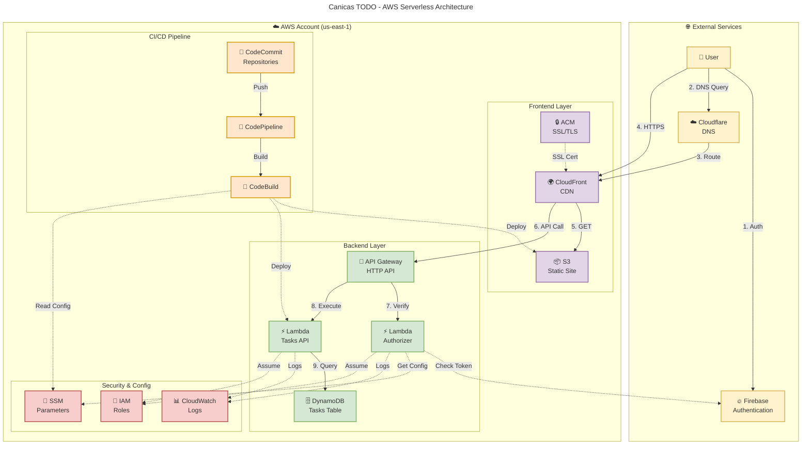

## 📊 Architecture Overview

**Cost:** $0.00/month (100% AWS Free Tier)

**Components:**
- **External:** Firebase Auth, Cloudflare DNS
- **Frontend:** CloudFront + S3 + ACM
- **Backend:** API Gateway + Lambda (x2) + DynamoDB
- **CI/CD:** CodeCommit + CodePipeline + CodeBuild
- **Security:** SSM + CloudWatch + IAM

**Flow:**
1. User authenticates with Firebase
2. DNS resolves via Cloudflare
3. HTTPS traffic through CloudFront
4. Static content from S3
5. API calls to API Gateway
6. Lambda Authorizer verifies Firebase token
7. Lambda Backend queries DynamoDB
8. All logs to CloudWatch

**Legend:**
- Solid lines (→) = Data flow
- Dashed lines (-.→) = Configuration/Auth
