```mermaid
---
title: Canicas TODO - AWS Serverless Architecture (Amplify)
---
graph TB
    %% External Services
    subgraph External["🌐 External Services"]
        User["👤 User"]
        Firebase["🔥 Firebase<br/>Authentication"]
        Cloudflare["☁️ Cloudflare<br/>DNS"]
    end
    
    %% AWS Services
    subgraph AWS["☁️ AWS Account (us-east-1)"]
        
        subgraph Frontend["Frontend Layer"]
            ACM_Front["🔒 ACM<br/>SSL/TLS"]
            Amplify["🚀 Amplify<br/>Hosting + CDN"]
        end
        
        subgraph Backend["Backend Layer"]
            ACM_API["🔒 ACM<br/>SSL/TLS"]
            APIGW["🚪 API Gateway<br/>HTTP API"]
            AuthLambda["⚡ Lambda<br/>Authorizer"]
            TasksLambda["⚡ Lambda<br/>Tasks API"]
            DynamoDB["🗄️ DynamoDB<br/>Tasks Table"]
        end
        
        subgraph CICD["CI/CD Pipeline"]
            CodeCommit["📝 CodeCommit<br/>Repositories"]
            CodePipeline["🔄 CodePipeline"]
            CodeBuild["🔨 CodeBuild<br/>(Manual Deploy)"]
        end
        
        subgraph Security["Security & Config"]
            SSM["🔐 SSM<br/>Parameters"]
            CloudWatch["📊 CloudWatch<br/>Logs"]
            IAM["👥 IAM<br/>Roles"]
        end
    end
    
    %% User Flow
    User -->|1. Auth| Firebase
    User -->|2. DNS Query| Cloudflare
    Cloudflare -->|3. Route| Amplify
    User -->|4. HTTPS| Amplify
    
    %% Frontend Flow
    ACM_Front -.->|SSL Cert| Amplify
    Amplify -->|5. API Call| APIGW
    
    %% Backend Flow
    ACM_API -.->|SSL Cert| APIGW
    APIGW -->|6. Verify| AuthLambda
    AuthLambda -.->|Check Token| Firebase
    AuthLambda -.->|Get Config| SSM
    APIGW -->|7. Execute| TasksLambda
    TasksLambda -->|8. Query| DynamoDB
    
    %% Logging
    TasksLambda -.->|Logs| CloudWatch
    AuthLambda -.->|Logs| CloudWatch
    
    %% CI/CD Flow (Manual)
    CodeCommit -.->|Push| CodePipeline
    CodePipeline -.->|Trigger| CodeBuild
    CodeBuild -.->|Manual Script| Amplify
    CodeBuild -.->|Manual Script| TasksLambda
    CodeBuild -.->|Read Config| SSM
    
    %% Security
    TasksLambda -.->|Assume| IAM
    AuthLambda -.->|Assume| IAM
    
    %% Styling
    classDef external fill:#fff2cc,stroke:#d6b656,stroke-width:2px
    classDef frontend fill:#e1d5e7,stroke:#9673a6,stroke-width:2px
    classDef backend fill:#d5e8d4,stroke:#82b366,stroke-width:2px
    classDef cicd fill:#ffe6cc,stroke:#d79b00,stroke-width:2px
    classDef security fill:#f8cecc,stroke:#b85450,stroke-width:2px
    
    class User,Firebase,Cloudflare external
    class ACM_Front,Amplify frontend
    class ACM_API,APIGW,AuthLambda,TasksLambda,DynamoDB backend
    class CodeCommit,CodePipeline,CodeBuild cicd
    class SSM,CloudWatch,IAM security
```

## 📊 Architecture Overview

**Cost:** $0.00/month (100% AWS Free Tier)

**Components:**
- **External:** Firebase Auth, Cloudflare DNS
- **Frontend:** AWS Amplify + ACM (replaces CloudFront + S3)
- **Backend:** API Gateway + Lambda (x2) + DynamoDB
- **CI/CD:** CodeCommit + CodePipeline + CodeBuild (manual deploy via scripts)
- **Security:** SSM + CloudWatch + IAM

**Flow:**
1. User authenticates with Firebase
2. DNS resolves via Cloudflare
3. HTTPS traffic through Amplify (includes CDN)
4. API calls to API Gateway
5. Lambda Authorizer verifies Firebase token
6. Lambda Backend queries DynamoDB
7. All logs to CloudWatch

**Legend:**
- Solid lines (→) = Data flow
- Dashed lines (-.→) = Configuration/Auth
